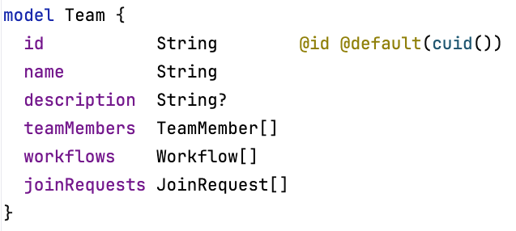
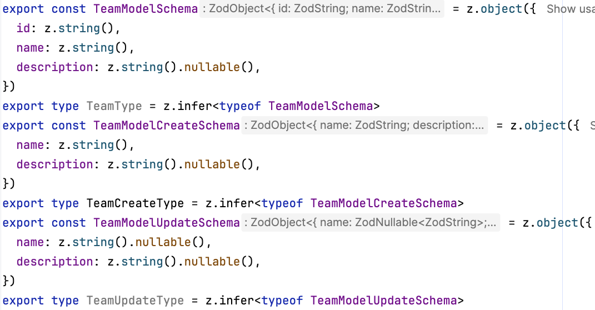

# prisma-generator-zod-easy

Этот генератор создает zod-схемы для проверки сущности, создания и обновления записей в БД из Prisma-схемы

## Пример

| Prisma-схема               | Zod-схемы                    |
|----------------------------|------------------------------|
|  |  |

## Установка

## Применение

Добавьте новый блок generator в вашу схему `schema.prisma` и запустите `prisma generate`

```prisma
generator zod {
  provider = "prisma-generator-zod-easy"
  output   = "../src/shared/zod"
}
```